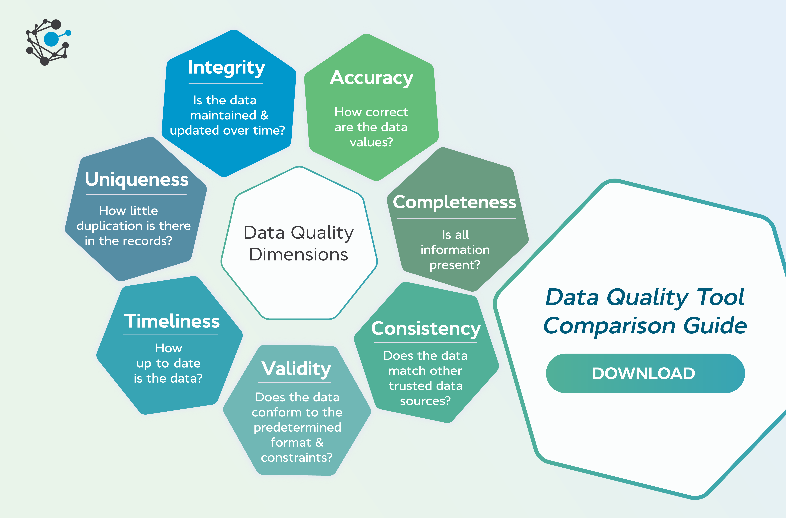
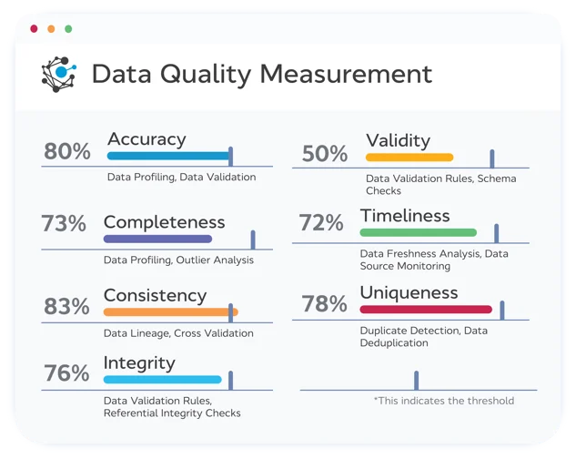

# Data Quality

# Integrity

- **Definition :** The integrity of your data is the measure of your data being accurate, consistent, and reliable over time. For example, 
               you might get your data to a certain quality now, but over the next few years, this could deteriorate as more data is added, 
               modified, and deleted.
               This is important to measure because if your integrity degrades, then your decision-making will inevitably suffer too.
               Part of this assessment is the continued use of data validation rules as we covered for validity, but you’ll also want to carry out referential integrity checks.
- **แปลภาษาไทยของ Definition :** ความสมบูรณ์ของข้อมูลหมายถึงการที่ข้อมูลของคุณมีความถูกต้อง สม่ำเสมอ และเชื่อถือได้ตลอดเวลา ตัวอย่างเช่น คุณอาจปรับคุณภาพข้อมูลให้ดีในปัจจุบันได้ แต่ในช่วงหลายปีข้างหน้า ความสมบูรณ์ของข้อมูลอาจเสื่อมลงเมื่อมีการเพิ่ม แก้ไข หรือลบข้อมูล
                              สิ่งนี้มีความสำคัญที่จะต้องวัดผล เพราะหากความสมบูรณ์ของข้อมูลลดลง การตัดสินใจของคุณก็จะได้รับผลกระทบในทางลบเช่นกัน 
                              ส่วนหนึ่งของการประเมินนี้คือการใช้กฎการตรวจสอบความถูกต้องของข้อมูล (Data Validation Rules) อย่างต่อเนื่องเหมือนที่ได้กล่าวไว้ในเรื่องความถูกต้องของข้อมูล (Validity) แต่คุณยังต้องทำการตรวจสอบความสมบูรณ์เชิงอ้างอิง (Referential Integrity Checks) ด้วย
- **ความหมายของ chat GPT** : Integrity ในบริบทของ Data Quality หมายถึงความถูกต้องและสอดคล้องของข้อมูลภายในระบบหรือฐานข้อมูล ซึ่งเน้นเรื่องความสัมพันธ์และความสมบูรณ์ของข้อมูลที่สอดคล้องกันในทุกส่วนของระบบ โดยมักเกี่ยวข้องกับการรักษาความถูกต้องในเชิงโครงสร้างและเนื้อหา
- **ความหมายของ Gemini :** ความซื่อสัตย์ (Integrity) ในคุณภาพข้อมูล หมายถึง ความสมบูรณ์และความถูกต้องของข้อมูลที่สะท้อนถึงความเป็นจริงอย่างครบถ้วน ไม่บิดเบือน หรือมีการแก้ไขเพิ่มเติมที่อาจทำให้ข้อมูลผิดเพี้ยนไปจากความเป็นจริงเดิม
- **สรุปใจความสำคัญของตัวเอง :** Integrity หมายถึงความสมบูรณ์และความถูกต้องของข้อมูลทั้งในเชิงโครงสร้าง และเนื้อหา โดยข้อมูลต้องสะท้อนความเป็นจริงอย่างครบถ้วน สอดคล้องกันในทุกส่วนของระบบไม่มีการบิดเบือนหรือแก้ไขจนทำให้ข้อมูลผิดเพี้ยนจากความเป็นจริง

- **ตัวอย่าง Integrity ในบริบทของ Data Quality**
  - **Referential Integrity ในฐานข้อมูลลูกค้าและคำสั่งซื้อ**
    - ตารางลูกค้า (Customer) มี Primary Key เป็น Customer_ID
    - ตารางคำสั่งซื้อ (Order) ใช้ Customer_ID เป็น Foreign Key
    - หากมีคำสั่งซื้อในตาราง Order แต่ไม่มี Customer_ID ที่ตรงกันในตารางลูกค้า จะถือว่าขาด Referential Integrity

  - **Entity Integrity ในฐานข้อมูลพนักงาน**
    - ทุกพนักงานต้องมี Employee_ID ที่ไม่ซ้ำกัน
    หากมีพนักงานสองคนที่มีรหัส Employee_ID ซ้ำกัน อาจทำให้ระบบไม่สามารถระบุข้อมูลเฉพาะของแต่ละคนได้

  - **Data Consistency**
    - ชื่อของลูกค้าในระบบ CRM ต้องเหมือนกันในทุกโมดูล เช่น หากอัปเดตที่อยู่ในโมดูลการขาย โมดูลการเงินก็ต้องแสดงที่อยู่เดียวกัน
    - ตัวอย่าง: ลูกค้า "บริษัท ABC จำกัด" ในโมดูลหนึ่งใช้ชื่อย่อ "ABC" แต่ในอีกโมดูลใช้ชื่อเต็ม "บริษัท ABC จำกัด" ถือว่าขาดความสอดคล้อง
- **[Integrity](https://www.ovaledge.com/blog/data-quality-metrics)**
- นางสาวเขมิกา จันทร์งาม 6530200037 sec800 🍐
