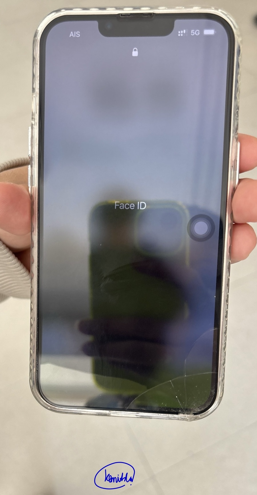

# Sercurity Control

- [Source](https://www.infosectrain.com/blog/types-of-security-controls/)
- รูปที่ถ่ายด้วยตนเอง

- เป็นรูปที่ **Scan หน้า Face ID**เพื่อเข้าโทรศัพท์มือถือของเพื่อน Iphone 13
- การสแกนหน้า Face ID จัดอยู่ใน:
  - **Type of Security Controls**: Technical Controls
  - **Control Functions**: Preventative
  - **เหตุผล**: การสแกนหน้า Face ID เป็นเทคโนโลยีที่ช่วยป้องกันการเข้าถึงข้อมูลหรืออุปกรณ์โดยไม่ได้รับอนุญาต ทำหน้าที่เป็นการควบคุมเชิงป้องกัน (Preventative) เพื่อปกป้องความปลอดภัยล่วงหน้า
- นางสาวเขมิกา จันทร์งาม 6530200037 sec800 🍐
